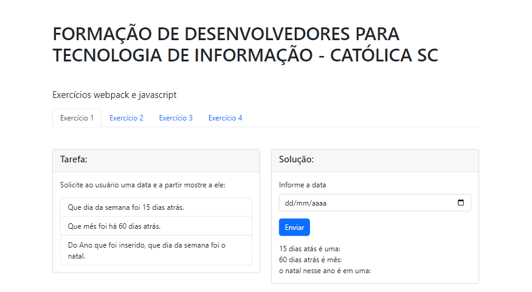

   

  

  &#xa0;

<h1 align="center">Exercícios webpack e javascript</h1>

  

  

  

 

## :information_source: About

Esse repositório contém os arquivos dos exercícios usando a biblioteca [Moment.js](https://github.com/moment/moment/) das aulas de javascript e webpack.

Essa solução também faz uso no frontend das bibliotecas [Bootstrap](https://github.com/twbs/bootstrap/) e [Inputmask](https://github.com/RobinHerbots/Inputmask/).

&#xa0;
## :rocket: Technology Stack ##

The following tools were used in this project:

- [Node.js](https://github.com/nodejs/node/)
- [Webpack](https://github.com/webpack/webpack/)
- [Moment.js](https://github.com/moment/moment/)
- [Jquery.Inputmask](https://github.com/RobinHerbots/Inputmask/)
- [Lodash](https://github.com/lodash/lodash/)
- [Bootstrap](https://github.com/twbs/bootstrap/)
- [Jquery](https://github.com/jquery/jquery/)

&#xa0;
## Autores

- [@rss-ptk](https://www.github.com/rss-ptk)

&#xa0;
<a href="#top">Back to top</a>
